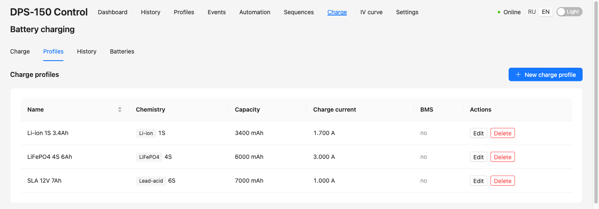
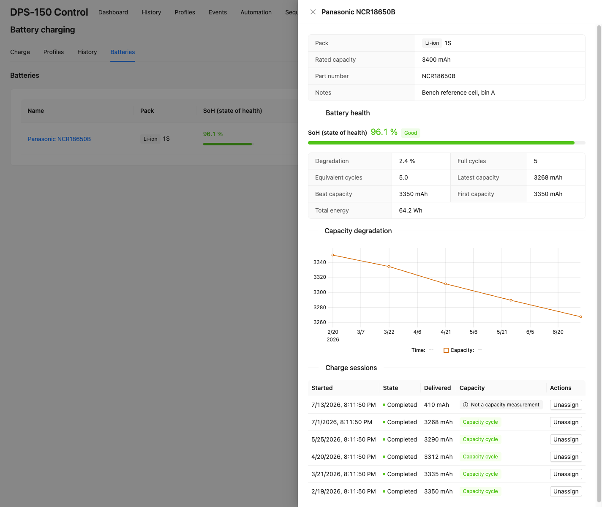

# Зарядка аккумуляторов и здоровье АКБ

Страница **«Заряд»** превращает DPS-150 в контролируемое CC-CV зарядное устройство
и отслеживает здоровье ваших ячеек на протяжении их жизни. Четыре вкладки —
**Заряд** (старт / живой процесс), **Профили**, **История** и **Батареи**.

> ⚠️ Зарядка аккумуляторов небезопасна по своей природе. Приложение обеспечивает
> строгий, неотключаемый защитный контур (ниже), но выбор правильной химии, числа
> ячеек и тока для вашей сборки — на вас, как и правило «не оставлять заряд без
> присмотра».

## Зарядка аккумулятора (F-023)

Зарядник — это конечный автомат под супервизией бэкенда: заряд идёт на сервере и
продолжается независимо от браузера. Заряд — это пресет химии, скомпилированный в
упорядоченный список фаз:

`preflight → [precharge] → CC → CV → [absorb / float для Pb] → done`

Терминация решается по **измеренным** напряжению и току (спад тока ниже порога при
напряжении заряда), а не по advisory-флагу CC/CV прибора.

### Поддерживаемые химии

| Химия | Заряд / отсечка на ячейку | Примечания |
|---|---|---|
| **Li-ion** | 4.20 В CV, спад C/20 | precharge ниже 3.0 В/яч |
| **LiFePO4** | 3.65 В CV | precharge ниже 2.5 В/яч, без float |
| **Свинец (Pb)** | 2.40 В absorb → 2.25 В float | float держится до остановки |

Многобаночный литий (`cells ≥ 2`) требует **attested BMS/балансир** — DPS-150
заряжает пакет целиком без поячеечного контроля, и разбаланс может увести одну
ячейку в перенапряжение при безопасном среднем. NiMH намеренно не предлагается
(нет автономной −ΔV-терминации и датчика температуры *батареи* на этом железе).

### Шаги

1. **Создайте профиль заряда** (вкладка «Профили»): имя, химия, число ячеек,
   ёмкость пакета (мА·ч) и ток заряда. Ёмкость кормит защитный кап и метрику
   `эквивалентных циклов`.
2. Откройте вкладку **«Заряд»** и выберите профиль.
3. Сначала выполняется **pre-flight**: он выключает выход, ждёт осадки напряжения
   на клеммах и читает напряжение холостого хода. Он **отказывает в старте** при
   неверном числе ячеек (соседние числа алиасят — полный 2S ≈ разряженный 3S),
   обратной полярности / отрицательном чтении или отсутствии батареи (≈ 0 В).
   Диалог показывает расчётные лимиты; старт — явное подтверждаемое действие
   (включение выхода всегда подтверждается).
4. Наблюдайте **живой** процесс: график V + I с полосами фаз, текущую фазу,
   прошло / ETA, отданные мА·ч / Вт·ч и прогресс-бары защитных капов.

### Защитный контур (всегда включён)

- **Порядок старта** protections → уставка V → уставка I → output-on, чтобы выход
  никогда не включался со старой уставкой.
- **Watchdog устаревания телеметрии** — если телеметрия пропадает на несколько
  секунд, заряд падает в fault и выход гасится (зависший прибор через raw-TCP-мост
  *не* проявляется как потеря линка, поэтому именно это, а не состояние линка —
  первичный триггер).
- **`SafeOutputOff` на каждом выходе** (финиш, стоп, срабатывание защиты, fault) —
  свежее, ретраящееся, подтверждённое телеметрией выключение выхода; неподтверждённое
  выключение эскалируется в алярм.
- Per-phase таймауты, абсолютный потолок напряжения (софт + аппаратный OVP), кап
  ёмкости (115–125 % от номинала) и OVP/OCP/OPP/OTP прибора из профиля.
- **Единый interlock** — пока заряд владеет выходом, ручное управление, IV-свипы и
  секвенции блокируются с `409` (и наоборот).
- **Реконсиляция при старте** — если бэкенд упал во время заряда, при рестарте он
  финализирует осиротевшую сессию и гасит бесхозный выход.

## Здоровье АКБ и трекинг циклов (F-026)

Вкладка **«Батареи»** — библиотека ваших физических аккумуляторов. Каждый
завершённый заряд можно привязать к батарее, и приложение выводит её здоровье из
накопленных зарядов.

### Гейт честной ёмкости — прочтите это

`deliveredMah` — это **заряд, принятый за одну сессию**, а *не* ёмкость батареи.
Статус `completed` означает лишь, что сработала CC-CV-отсечка (пакет закончил
полным) — он ничего не говорит о том, откуда заряд *начался*. Рутинная подзарядка
с 80 % — это `completed`-заряд, отдавший совсем немного, поэтому засчитывать каждый
completed-заряд как измерение ёмкости — значит показывать здоровую батарею как
деградировавшую.

Поскольку DPS-150 — источник и не умеет разряжать, режима теста ёмкости нет. Вместо
этого зарядник записывает **стартовое напряжение холостого хода**, и сессия
считается **точкой данных по ёмкости** только когда это был настоящий заряд
*с пустого* — стартовое напряжение на ячейку было на уровне или ниже порога
«пусто» для химии (Li-ion ≤ 3.00 В, LiFePO4 ≤ 2.50 В, Pb ≤ 1.90 В/яч). Всё
остальное (подзарядки, прерванные заряды и сессии до F-026 без записанного
стартового напряжения) по-прежнему числится за батареей, но помечается **«не
измерение ёмкости»** и исключается из чисел по ёмкости.

### Как пользоваться

1. **Создайте батарею** (Батареи → Новая): имя, химия, число ячеек, необязательная
   номинальная ёмкость (мА·ч) и партномер / заметки. Химия и число ячеек
   фиксируются при создании.
2. Из вкладки **«История»** **привяжите** завершённую сессию заряда к батарее
   («Привязать к батарее»). Химия и число ячеек сессии должны совпадать с батареей.
   Перепривязать или отвязать можно в любой момент.
3. Откройте батарею, чтобы увидеть её здоровье.

### Метрики здоровья

- **SoH (state of health)** — `latest / номинал`, если задана номинальная ёмкость,
  иначе `latest / best`. Показывается полосой (обрезана до 100 %) и истинным числом
  (может превышать 100 % для сильного пакета).
- **Деградация** — `1 − latest / best`, спад от лучшего from-empty-заряда за всё
  время (0 % на пике).
- **Полных циклов** — число настоящих from-empty (capacity-eligible) зарядов.
- **Эквивалентных циклов** — `Σ отданных мА·ч / номинал`, прокси износа по
  пропускной способности по *всем* completed-зарядам (нужен номинал).
- **Latest / best / first ёмкость** и **суммарная энергия** (Вт·ч).
- **Кривая деградации ёмкости** — ёмкость (мА·ч) во времени, строится ровно по тому
  же capacity-eligible-набору, что и число SoH, поэтому график и заголовок никогда
  не расходятся.

> **Оговорка по свинцу:** заряд Pb кулоновски неэффективен (~80–90 %) — отданные
> мА·ч включают заряд, потерянный на газовыделение/тепло, поэтому «ёмкость» Pb
> завышена. Читайте тренд Pb как относительный, не абсолютный.

Трекинг внутреннего сопротивления (Rint) запланирован на будущую версию — ему нужно
дополнительное измерение во время заряда.

## См. также

- [IV-трейсер (ВАХ) и библиотека компонентов](iv-tracer.ru.md)
- Дизайн: `docs/architecture/design.md` §3.7 (заряд), §3.10 (здоровье АКБ)
