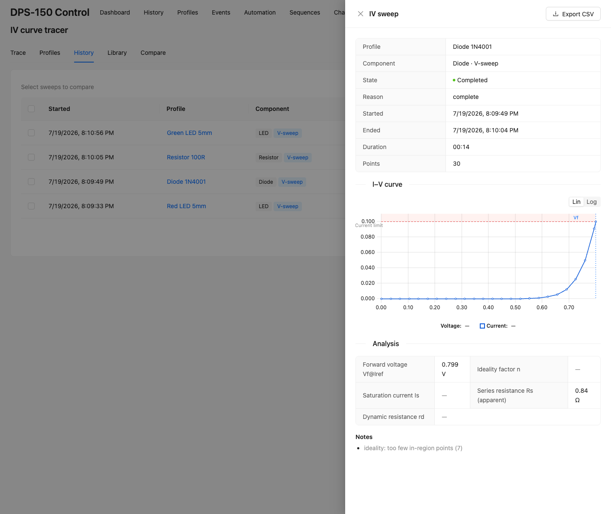
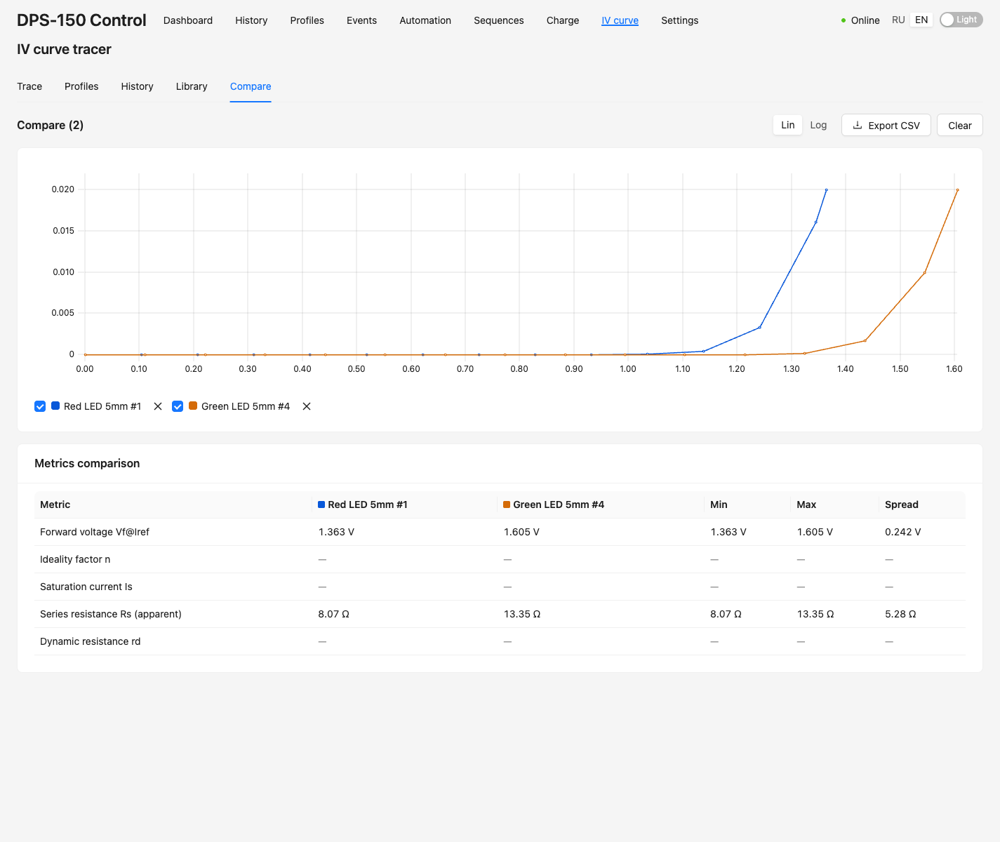
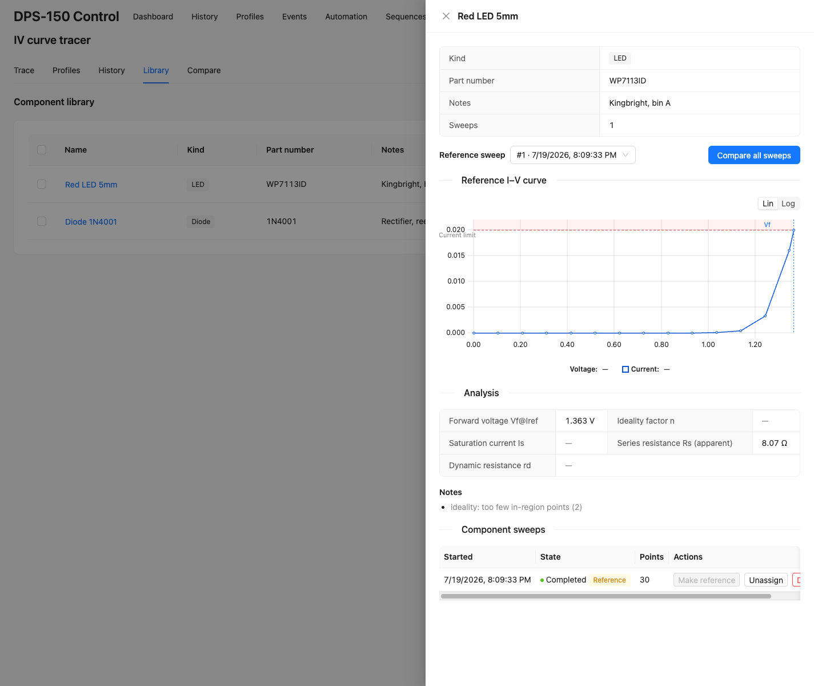

# IV curve tracer & component library

The **IV curve** page (ВАХ) sweeps a two-terminal component and plots its current
against voltage — an I(V) curve — then analyses it, lets you overlay several curves
for comparison, and keeps a library of characterised parts. Tabs: **Trace**
(start / live), **Profiles**, **History**, **Library**, **Compare**.

## Tracing a curve (F-024)

A sweep is a telemetry-driven step loop: for each step the tracer writes a setpoint,
waits for a settled reading and records the **measured** `(V, I)` point. The
DPS-150 is a source with a **compliance** limit — the current limit (for a voltage
sweep) or voltage ceiling (for a current sweep) that protects the device under test
(DUT). Every recorded point is where the DUT's curve meets that limit, so it is a
true point on the component's I(V) characteristic.

### Component presets

| Component | Sweep | Compliance | Analysis |
|---|---|---|---|
| **LED** | 0 → 6 V | 20 mA | Vf @ 20 mA, ideality *n*, apparent Rs, rd |
| **Diode** (1N400x) | 0 → 1 V | 100 mA | Vf @ 100 mA (knee), *n*, apparent Rs, rd |
| **Zener** | 0 → Vz + ~20 % | derived from Pmax/Vz | Vz @ Izt, Zzt (connect reverse) |
| **Resistor** | 0 → √(P·R) | Vmax/R | R, R², max deviation |
| **Lamp** | 0 → rated | ~1.5× rated I | cold R, hot R, ratio |

### Steps

1. **Pick a preset** (or a saved profile) on the Trace tab — it fills in the sweep
   range, compliance and step count for that component type. Wire the DUT to the
   terminals (a Zener goes **reverse** — cathode to +).
2. **Start** — enabling the output is a confirmed action. The output energises with
   the compliance already in place, and the live I(V) curve builds point by point.
3. When the sweep finishes, open it (History, Library, or the live view) to see the
   curve, the shaded compliance band and the **Analysis** panel.

### Honest analysis — no fabricated numbers

Real sweeps break naïve curve-fitting, so **every metric is nullable**. When a
value can't be computed reliably the app shows **"—"** with a reason in the
*Notes*, never a confident wrong number:

- A **non-conducting** DUT (open, reversed, `vStop` below Vf) → `did-not-conduct`,
  no metrics.
- The ideality **n** is fit only over the exponential region (selected by measured
  current, excluding noise-floor and compliance-clamped points); with too few
  points it stays "—", and even when computed it is labelled **approximate** (a
  linear voltage sweep under-samples the decade).
- A **Zener** that never reached breakdown → `breakdown-not-reached`, no Vz.
- Series resistance is labelled **apparent** (it overestimates the true Rs).

In the screenshot above the ideality is honestly "—" ("too few in-region points")
while Vf and the apparent Rs are reported.

## Comparing sweeps (F-025)

The **Compare** tab overlays several I(V) curves on one chart. Reach it three ways:
multi-select sweeps in **History**, pick several components in **Library**, or
"Compare all sweeps" from a component. The selection lives in the URL
(`?tab=compare&ids=…`), so a comparison is **bookmarkable and shareable**.

- Curves are drawn raw, auto-fit to the union, with a **linear / log Y** toggle
  (log is the right lens for diodes/LEDs), a per-curve show/hide legend, and up to
  ~8 curves.
- When every selected sweep is the **same component type**, a **metrics comparison
  table** appears with a min / max / **spread** column — ideal for matching or
  binning a batch of LEDs or diodes. Nulls are ignored (they never become NaN).
- **Export CSV** downloads all selected curves in one long-format file
  (`sweepId, label, index, voltage, current, power`).

## Component library (F-025)

The **Library** tab is a catalogue of characterised physical parts (name, kind,
part number, notes). Assign one or more sweeps to a component and pin one as the
**reference** — its stored metrics and curve become the component's canonical
characterisation.

Use it to build a bench reference for a part, track a component across
temperatures, or "Compare all sweeps" to see its spread. Deleting a component never
deletes its sweeps; the reference pin auto-heals if the pinned sweep is unassigned.

> **No solar / PV curves.** A photovoltaic I-V curve (Pmax, Vmp, Imp, fill-factor)
> is traced by loading an *illuminated* cell as it delivers power — the DPS-150 is a
> single-quadrant source and cannot sink a cell's photocurrent, so that quadrant is
> physically unreachable. A *dark* forward sweep of a cell is just the diode
> analysis above.

## See also

- [Battery charging & health](charging.md)
- Design: `docs/architecture/design.md` §3.8 (IV tracer), §3.9 (compare + library)
